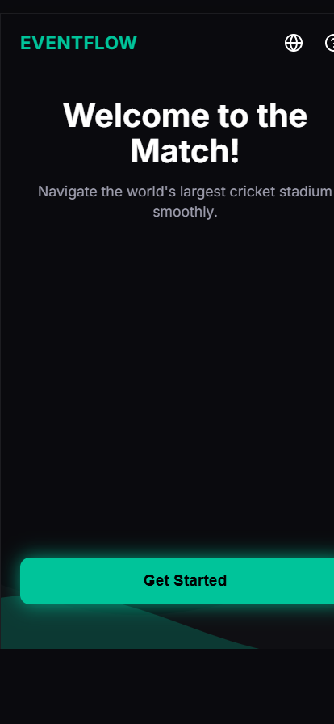
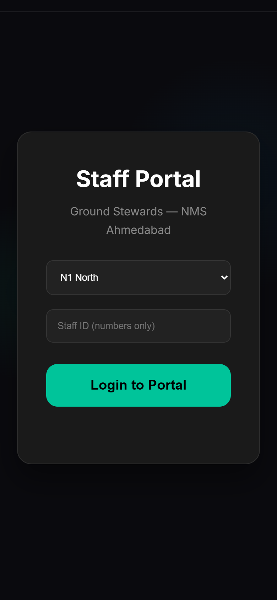
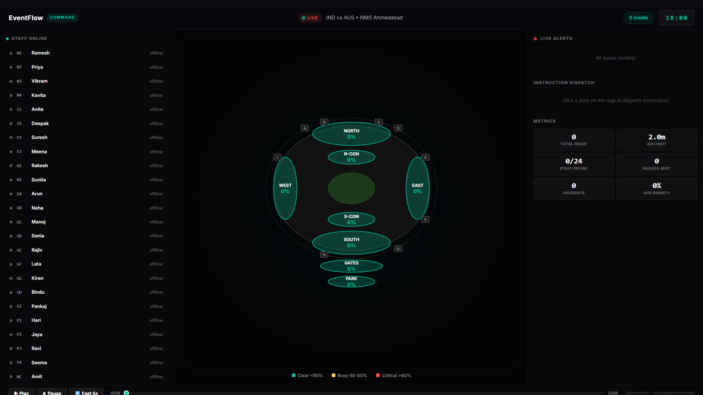

# EventFlow — Smart Crowd Management for NMS

[](https://studio-5460981965-b6a76.web.app/)
[](https://studio-5460981965-b6a76.web.app/)
[](https://studio-5460981965-b6a76.web.app/staff)
[](https://studio-5460981965-b6a76.web.app/control)

## Live Demo Links
| Panel | URL | Device |
|-------|-----|--------|
| 📱 Attendee App | https://studio-5460981965-b6a76.web.app/ | Mobile |
| 🧑✈️ Staff Panel | https://studio-5460981965-b6a76.web.app/staff | Mobile |
| 🖥️ Control Room | https://studio-5460981965-b6a76.web.app/control | Desktop |

## Problem Statement
Managing a crowd of 132,000 people at Narendra Modi Stadium
(NMS), Ahmedabad presents overwhelming logistical challenges.
Massive surges during entry, exit, and innings breaks cause
dangerous bottlenecks. Traditional PA announcements and static
signage fail because they lag behind real-time crowd shifts and
often incite panic. The fundamental physical event experience
is degraded by unpredictable crowding and broken trust between
venue systems and attendees.

## Our Vertical
**Physical Event Experience** — Narendra Modi Stadium,
Ahmedabad (132,000 capacity cricket venue)

## The Core Insight
Existing solutions dictate behavior uniformly — blasting
"Use Gate C" to 50,000 people shifts the bottleneck, not
solves it. Our **trust-first approach** gives each user a
personally optimized, transparent view of hyper-local crowd
reality. Users make self-interested decisions that naturally
create systemic equilibrium — without being commanded.

## Biomimicry Approach
We looked to nature for solutions humans solved millions of
years before technology existed:

- **Ant Pheromone Logic** — Like ants following the strongest
  trail, EventFlow dynamically strengthens the signal of clear
  paths and fades crowded ones. Users always see only the best
  option, never the problem.
- **Fish School Coordination** — Like fish moving as one unit
  without a leader, EventFlow silently clusters groups of
  similar size and destination together, distributing load
  organically without users knowing they are coordinated.
- **Waggle Dance Pre-Planning** — Like bees reporting the best
  pollen source before the hive moves, our pre-match intake
  models crowd flow before a single fan reaches the gates.

## Solution Architecture

### 📱 Attendee Portal (/)
Mobile-first PWA for fans. Provides personalized arrival plans,
live step-by-step escort navigation, smart contextual nudges
before congestion forms, group coordination tools, tiered exit
planning, and post-match feedback. Available in 5 languages.
Works offline via Service Worker.

### 🧑✈️ Staff Panel (/staff)
Ultra-fast one-handed mobile UI for ground stewards. Two-tap
zone status reporting (Clear/Crowded), instant receipt of
Control Room instructions with acknowledgment, and quick
incident reporting. Designed for a steward moving through
a crowd.

### 🖥️ Control Room (/control)
Desktop command center with live interactive NMS SVG schematic.
Real-time crowd density heatmap, staff status tracking,
instruction dispatch to specific zones, attendee nudge
broadcasting, and full simulation timeline control for demo.

## Screenshots

### Attendee Portal (Fan PWA)

*Personalized match plan with live zone status*

### Staff Panel (Ground Steward)

*One-tap zone reporting with instant control room sync*

### Control Room (Command Center)

*Live NMS schematic with crowd density simulation*

## Google Services Used
- **Firebase Realtime Database** — Tridirectional live sync
  between all three panels via WebSocket listeners
- **Firebase Hosting** — Edge-cached frontend deployment
- **Google Maps JavaScript API** — Venue zone mapping with
  NMS coordinates (lat: 23.0925, lng: 72.5952) and SVG
  fallback for offline use
- **Google Translate API** — Powers the i18n system across
  5 languages: English, Hindi (हिंदी), Gujarati (ગુજરાતી),
  Tamil (தமிழ்), Telugu (తెలుగు)

## How It Works
1. **Pre-Event** — Ticket holders open the PWA link from SMS
   and complete a 30-second intake: arrival time, group size,
   transport mode, parking zone, post-match destination. The
   system builds their personal venue plan instantly.
2. **Arrival** — App shows recommended gate with live density
   reason. Step-by-step escort navigation guides them to their
   seat one instruction at a time.
3. **During Match** — Smart nudges surface 5 minutes before
   innings break. Control Room monitors density. Staff report
   ground truth. Attendees receive gentle rerouting suggestions,
   never alarming commands.
4. **Exit** — App surfaces exit plan 20 minutes before match
   end with three timed options: Leave Now, Wait 15 Min, Stay
   for Presentation. Crowd exits in waves, not a simultaneous
   stampede.
5. **Post-Match** — 3-question feedback form improves
   predictions for next match.

## Demo Instructions (5-Minute Path)
Open three browser windows simultaneously:

**Window 1 — Desktop:**
https://studio-5460981965-b6a76.web.app/control

**Window 2 — Mobile viewport (F12 → phone icon):**
https://studio-5460981965-b6a76.web.app/staff

**Window 3 — Mobile viewport:**
https://studio-5460981965-b6a76.web.app/

**Demo Flow:**
1. Control Room → scrub timeline forward → Zone N3 turns red
2. Staff → Login: ID `123`, Zone `N3 North` → zone shows red
3. Control Room → click N3 → dispatch: "Redirect to Gate 11"
4. Staff → instruction appears instantly → tap ✓ Acknowledged
5. Control Room → acknowledgment registers in real-time
6. Staff → tap "🔴 MY ZONE IS CROWDED" toggle
7. Attendee → complete intake → view personal plan
8. Attendee → switch language English ↔ Hindi mid-session
9. Attendee → receive nudge from control room

## Assumptions Made
- Crowd data is simulated (500-attendee model, Control Room
  scrubber controls timeline)
- Indoor positioning is zone-based proxy (ticket section),
  not GPS/BLE hardware
- Ground staff carry modern smartphones with browser access
- Firebase Spark free tier is sufficient for prototype demo

## Local Setup
1. Clone: `git clone https://github.com/chparam612/Event_flow.git`
2. Install: `npm install`
3. Run: `node server.js`
4. Open: `http://localhost:3000`

The app works without API keys (SVG map fallback included).
For Google Maps, add your key to index.html Maps script tag.

## Running Tests
```bash
npm test
```

## Accessibility
- WCAG 2.1 AA compliant color contrast
- Screen reader compatible with ARIA labels
- Keyboard navigable
- 5 language support for diverse users

## Future Roadmap
- **Google Cloud Vision API** — Wire CCTV feeds for real
  frame-by-frame density detection replacing steward polling
- **BLE Beacon Network** — Precise indoor positioning across
  NMS concrete structure where GPS fails
- **AR Wayfinding** — Step-by-step escort via device camera
  using gyroscope data
- **Google Vertex AI** — Sub-dialect language expansion for
  regional vernaculars beyond the current 5 languages
- **Predictive ML** — Post-match feedback loop trains model
  for next-match accuracy improvement

---
*Built for Google Prompt Wars 2026 using Google AntiGravity IDE*
*Narendra Modi Stadium, Ahmedabad — 132,000 capacity*
